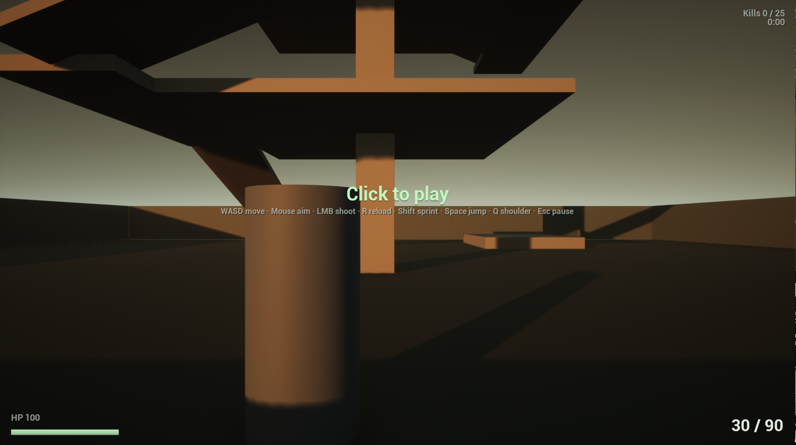

# Night Shift — Floor 37

Third-person arena shooter for Unreal Engine 5.8. One rainy night on an abandoned office floor. Wet tile, dying fluorescents, alien resin on the cubicles. Clear the floor. They keep coming.



## What it is

A small, tight arena: a 50 × 50 m office floor around a three-storey open atrium tower. Six aliens are alive at any time. They chase at 4 m/s, stop inside 12 m with line of sight, strafe, and fire three-round bursts. Three body hits or two headshots kill one; a dead alien is back in three seconds from the edge farthest from you. Win at 25 kills, and the timer is your score.

Everything the game needs is created from C++ at startup. There are no Blueprints, no Data Assets, no hand-built level. The one asset in the repo is a generated map with three actors in it. Editor content can be layered on later and overrides the code-built defaults.

## Controls

| Input | Action |
|---|---|
| WASD | Move |
| Mouse | Aim (over-the-shoulder camera) |
| Left click | Fire, full auto, 600 RPM |
| R | Reload |
| Shift | Sprint |
| Space | Jump, or mantle a low ledge |
| Q | Swap shoulder |
| Esc | Pause menu: mouse sensitivity slider, resume, quit |

Mouse sensitivity is saved to your user settings and persists between runs.

## Requirements

- Unreal Engine 5.8 (tested on macOS, Apple Silicon, Metal). Windows should work but has not been run.
- Xcode command-line tools on macOS.

## Build and run

Build the editor target in place. Build output is ignored by git.

```
cd ue5-scaffold
"/Users/Shared/Epic Games/UE_5.8/Engine/Build/BatchFiles/Mac/Build.sh" NightShiftFloor37Editor Mac Development -Project="$PWD/NightShiftFloor37.uproject"
```

Run standalone in a window:

```
"/Users/Shared/Epic Games/UE_5.8/Engine/Binaries/Mac/UnrealEditor" "$PWD/NightShiftFloor37.uproject" /Game/Maps/Floor37 -game -windowed -ResX=1600 -ResY=900
```

Or open `NightShiftFloor37.uproject` in the Editor and press Play. On Windows, use `Engine\Build\BatchFiles\Build.bat` and `UnrealEditor.exe` with the same arguments.

If the map is ever missing, regenerate it headlessly:

```
"/Users/Shared/Epic Games/UE_5.8/Engine/Binaries/Mac/UnrealEditor-Cmd" "$PWD/NightShiftFloor37.uproject" -run=pythonscript -script=Scripts/make_floor37_map.py -unattended -nop4 -nosplash
```

## Automated self-test

The match loop can verify itself without a human. Launch with `-NightShiftSelfTest` and the game starts a match, teleports an alien in front of the player and shoots it dead, waits for the respawn, pauses and resumes, walks out of bounds, dies, restarts, and wins, logging `SELFTEST PASS` / `SELFTEST FAIL` for each check and a summary line before exiting.

```
"/Users/Shared/Epic Games/UE_5.8/Engine/Binaries/Mac/UnrealEditor" "$PWD/NightShiftFloor37.uproject" /Game/Maps/Floor37 -game -nullrhi -unattended -nosplash -NightShiftSelfTest -abslog=/tmp/selftest.log
grep -E 'SELFTEST|NIGHTSHIFT' /tmp/selftest.log
```

## Repository layout

```
DESIGN.md         The design spec. Every number in the game traces to it.
PROJECT_MAP.md    Layout, status board, and the phased roadmap.
ue5-scaffold/     The Unreal project (this is the game).
  Source/         One C++ module, nine classes.
  Config/         Engine, game, and input settings.
  Content/Maps/   Floor37.umap, generated.
  Scripts/        Headless map generator.
  *.md            Editor drop-in guides for adding real content.
web/              Earlier Three.js prototype of the same spec. Not maintained.
```

## How the code is shaped

| Class | Owns |
|---|---|
| `UGameConfig` | Every tunable, with defaults matching the design doc |
| `AArenaGameMode` | Match state, timer, kills, win/lose, restart, alien pool, spawning what the map lacks |
| `AOfficeArena` | Bounds, spawn points, cover, and the greybox geometry and lighting |
| `ANightShiftCharacter` | Movement, camera, health, recoil, mantle, runtime-built Enhanced Input |
| `URifleComponent` | Fire, reload, ammo, soft-lock, hitscan |
| `AAlienBot` | Chase, strafe, burst, hit counting, flash, death and respawn |
| `UArenaCollision` | Push-apart between bots, fall damage |
| `UHUDWidget` | The whole HUD and pause menu, built in C++ |
| `AFXPoolManager` | Pooled tracers and muzzle lights |

Plain actors and components, no deep class trees, no per-frame allocations in the hot paths.

## Status

Compiles clean on UE 5.8, launches to the start prompt with the greybox arena, lighting, and HUD, and the automated self-test passes every check of the match loop: spawn spread, hitscan, kill counting, respawn, pause, bounds, death, restart, win. What is left is feel, which needs a human. See `PROJECT_MAP.md` for the status board and what comes next.
